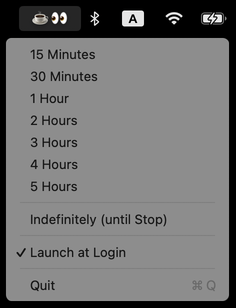

# ☕👀 Koffeinum

A native macOS menu bar app that prevents your Mac from sleeping — like `caffeinate`, but with a friendly UI.

Koffeinum sits in your menu bar showing **☕👀**. Click it to select a duration, and your Mac will stay awake. While active, the icon is replaced by an orange countdown timer: **1:56:34 👀**.



## Features

- **One-click sleep prevention** with predefined durations: 15m, 30m, 1h, 2h, 3h, 4h, 5h, plus **Indefinitely (until Stop)**
- **Orange countdown timer** in the menu bar while active (hidden when running indefinitely)
- **Launch at Login** support (macOS 13+)
- **Modifier keys** for fine-grained control over sleep prevention modes
- **Localised UI** in English, German and Dutch — automatically follows the macOS system language, falls back to English
- **Lightweight** — pure AppKit (no SwiftUI / Combine runtime), low memory and thread footprint

## Modifier Keys

Hold a modifier key while clicking a duration to change which type of sleep is prevented:

| Modifier | Effect | caffeinate flag |
|----------|--------|----------------|
| *(none)* | Prevent display + system idle sleep | `-d -i` |
| **⌥ Option (Alt)** | Prevent system idle sleep only | `-i` |
| **⌃ Ctrl** | Prevent disk sleep | `-m` |
| **⇧ Shift** | Prevent full system sleep | `-s` |

A tooltip appears near the cursor when a modifier key is held, showing exactly what that mode does.

> **Note:** Shift is used instead of ⌘ Cmd because AppKit reserves Cmd for menu key-equivalent dispatch, which makes it unreliable for alternate-menu-item selection.

## Localisation

Koffeinum ships with three localisations:

- 🇬🇧 / 🇺🇸 **English** — development language and fallback
- 🇩🇪 **Deutsch**
- 🇳🇱 **Nederlands**

The UI language is selected automatically from the macOS system language preference. Any language not in the list above falls back to English. To force a specific language, change your macOS language in *System Settings → General → Language & Region*, or (for testing) launch the app with `-AppleLanguages '(de)'` / `'(nl)'` / `'(en)'`.

Strings live in `Koffeinum/Resources/{en,de,nl}.lproj/Localizable.strings`; the canonical key list is in `Koffeinum/Sources/L10n.swift`.

## Installation

### Via Homebrew

```bash
brew tap posalex/homebrew-tap
brew install --cask koffeinum
```

### Manual

Download the latest `.zip` from [Releases](https://github.com/posalex/Koffeinum/releases), extract it, and move `Koffeinum.app` to `/Applications`.

### Gatekeeper Notice

Koffeinum is currently distributed **unsigned** (no Apple Developer ID). macOS Gatekeeper will block the app on first launch. To allow it, run:

```bash
xattr -d com.apple.quarantine /Applications/Koffeinum.app
```

Alternatively, right-click the app in Finder → **Open** and confirm the dialog once.

## Building from Source

Requires Xcode 15+ and macOS 12 (Monterey) or later.

```bash
git clone https://github.com/posalex/Koffeinum.git
cd Koffeinum
make build
```

## Make Commands

| Command | Description |
|---------|-------------|
| `make build` | Build the app (Release configuration) |
| `make debug` | Build the app (Debug configuration) |
| `make clean` | Remove build artifacts |
| `make run` | Build and launch the app |
| `make zip` | Create a distributable `.zip` |
| `make install` | Copy app to `/Applications` |
| `make uninstall` | Remove app from `/Applications` |
| `make version` | Show current version |
| `make bump-major` | Bump major version (X.0.0) |
| `make bump-minor` | Bump minor version (x.X.0) |
| `make bump-patch` | Bump patch version (x.x.X) |
| `make tag` | Create a git tag for the current version |
| `make release` | Create a GitHub release with `.zip` asset |
| `make publish-tap` | Update the Homebrew formula with current version and SHA |
| `make help` | Show all available commands |

## Release Workflow

```bash
# 1. Bump version
make bump-patch   # or bump-minor / bump-major

# 2. Commit the version change
git add -A && git commit -m "Bump version to $(make version)"

# 3. Build, package, tag, and publish to GitHub
make release

# 4. Update Homebrew formula
make publish-tap
cd ~/git/homebrew-tap && git add -A && git commit -m "Update koffeinum to $(make version)" && git push
```

## License

[GPLv3](LICENSE)
